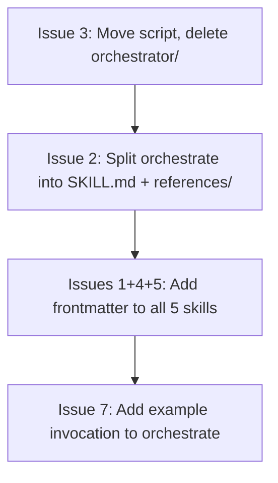

# Improve Agent Skills Specification Compliance

## Current State

Six directories live under [`.cursor/skills/`](.cursor/skills/):

```
.cursor/skills/
├── clarify/SKILL.md
├── judge/SKILL.md
├── orchestrate/SKILL.md          <-- the main orchestrator skill
├── orchestrator/scripts/          <-- orphan dir (no SKILL.md), holds create-debate-config.sh
├── role-agent/SKILL.md
└── role-clarify/SKILL.md
```

None of the five `SKILL.md` files have YAML frontmatter. The `orchestrator/` directory is a leftover that should be consolidated into `orchestrate/`.

---

## Issue 1 -- Add YAML frontmatter to all five skills

Every `SKILL.md` currently starts with a bare `# Heading`. The spec requires YAML frontmatter with at least `name` and `description`.

Add a frontmatter block to the **top** of each file (before the existing `# Heading`). The `name` must exactly match the parent directory name.

### `orchestrate/SKILL.md`

```yaml
---
name: orchestrate
description: >-
  Drives the full multi-agent design debate lifecycle: loads config, initializes
  the workspace, runs optional clarification, executes debate rounds (proposal,
  critique, refinement), dispatches the judge for convergence checks, and writes
  the final synthesis. Use when the user wants to start or run a design debate.
---
```

### `clarify/SKILL.md`

```yaml
---
name: clarify
description: >-
  Facilitates the pre-debate clarification phase. Each participating agent gets
  a chance to ask clarifying questions about the problem; the orchestrator relays
  them to the user and records answers. Use when clarifications are enabled in
  the debate config before the debate loop begins.
---
```

### `judge/SKILL.md`

```yaml
---
name: judge
description: >-
  Evaluates convergence across agent refinements and, when the debate ends,
  writes the final synthesized solution. Operates in two modes: convergence_check
  (per-round verdict) and synthesis (final output). Use when the orchestrator
  needs a convergence verdict or a final synthesis document.
---
```

### `role-agent/SKILL.md`

```yaml
---
name: role-agent
description: >-
  Executes a single debate phase (proposal, critique, or refinement) as one
  participant agent with a specific role perspective. Dispatched by the
  orchestrator once per agent per phase. Use when a subagent needs to produce
  a proposal, critique other proposals, or refine its own proposal.
---
```

### `role-clarify/SKILL.md`

```yaml
---
name: role-clarify
description: >-
  Generates clarifying questions from a specific role's perspective before the
  debate begins. Dispatched by the clarify skill for each agent. Use when an
  agent needs to ask the user clarifying questions about the problem statement.
---
```

---

## Issue 2 -- Progressive disclosure for `orchestrate`

The `orchestrate` skill is 319 lines and contains dense procedural detail. Split the debate-loop logic (Phases 3-6) into a reference file to keep the main SKILL.md focused on setup and high-level flow.

**New structure:**

```
orchestrate/
├── SKILL.md                          # Frontmatter + Phases 0-2 + summary dispatch to reference
├── scripts/
│   └── create-debate-config.sh       # Moved from orchestrator/ (see Issue 3)
└── references/
    └── debate-loop.md                # Phases 3-6 (clarifications, debate loop, synthesis, completion)
```

**Changes to `orchestrate/SKILL.md`:**

- Keep everything from the start through Phase 2 (workspace initialization) -- roughly lines 1-123.
- Replace the current Phase 3-6 content with a short instruction block:

```markdown
## Phases 3-6: Clarifications, Debate Loop, Synthesis, Completion

Read and follow [references/debate-loop.md](references/debate-loop.md) for the
remaining phases. That file contains the complete clarification phase, debate
loop (proposal / critique / refinement / convergence), synthesis, and completion
procedures.
```

**New file `orchestrate/references/debate-loop.md`:**

- Move the current content of Phases 3 through 6 (lines 126-319) into this file verbatim, with a brief heading at the top:

```markdown
# Debate Loop — Phases 3-6

Continuation of the orchestrate skill. Follow these phases in order after completing Phase 2.
```

---

## Issue 3 -- Fix the `orchestrator` vs `orchestrate` path bug and consolidate directories

The `orchestrate/SKILL.md` references a script at:
```
{PROJECT}/.cursor/skills/orchestrator/scripts/create-debate-config.sh
```

But the skill directory is `orchestrate/`, not `orchestrator/`. The script currently lives in a separate orphan directory `.cursor/skills/orchestrator/`.

**Steps:**

1. Move the script into the skill's own directory:
   - Create `orchestrate/scripts/`
   - Move `orchestrator/scripts/create-debate-config.sh` to `orchestrate/scripts/create-debate-config.sh`
2. Delete the now-empty `orchestrator/` directory.
3. Update the path reference in [`orchestrate/SKILL.md` line 27](.cursor/skills/orchestrate/SKILL.md) from:
   ```
   {PROJECT}/.cursor/skills/orchestrator/scripts/create-debate-config.sh
   ```
   to:
   ```
   {PROJECT}/.cursor/skills/orchestrate/scripts/create-debate-config.sh
   ```
4. Update the `PROJECT_ROOT` resolution in [`create-debate-config.sh` line 12](.cursor/skills/orchestrator/scripts/create-debate-config.sh). The current line:
   ```sh
   PROJECT_ROOT="$(CDPATH= cd -- "$(dirname -- "$0")/../../../.." && pwd)"
   ```
   This walks up 4 levels: `scripts/ -> orchestrator/ -> skills/ -> .cursor/ -> project_root`. After the move to `orchestrate/scripts/`, the depth is the same (4 levels), so **no change** is needed to this line. But verify after the move.

---

## Issue 4 -- Add `compatibility` field to frontmatter

Add the `compatibility` field to each skill's frontmatter. All five skills share the same environment requirement.

Add this line to each frontmatter block:

```yaml
compatibility: >-
  Requires Cursor IDE with Task tool for subagent dispatch. Requires the
  dialectic-agent project structure (prompts/, debate-config.json).
```

For the two "leaf" skills (`role-agent`, `role-clarify`) which are dispatched as subagents and don't dispatch others themselves, a simpler variant:

```yaml
compatibility: >-
  Designed to run as a Cursor subagent dispatched by the orchestrate or clarify
  skills. Requires the dialectic-agent project structure (prompts/).
```

---

## Issue 5 -- Add activation keywords to descriptions

This is handled as part of Issue 1. Each `description` field already includes the relevant trigger keywords:

- `orchestrate`: "debate", "design debate", "start", "run"
- `clarify`: "clarification", "clarifying questions", "pre-debate"
- `judge`: "convergence", "verdict", "synthesis", "synthesized solution"
- `role-agent`: "proposal", "critique", "refinement", "participant", "debate phase"
- `role-clarify`: "clarifying questions", "role", "problem statement"

No separate work item -- just verify the descriptions written in Issue 1 include these terms (they do as drafted above).

---

## Issue 6 -- Move script into skill's `scripts/` directory

This is handled as part of Issue 3 (consolidate `orchestrator/` into `orchestrate/`). No separate work item.

---

## Issue 7 -- Add example invocation to `orchestrate` only

Add an "Example Invocation" section to `orchestrate/SKILL.md`, placed after the Parameters section and before Phase 0. This gives agents (and humans) a concrete picture of what a real invocation looks like.

```markdown
## Example Invocation

```
WORKSPACE: /Users/me/projects/cache-redesign
PROJECT:   /Users/liors/dev/dialectic-agent
DEBATE_CONFIG: /Users/me/projects/cache-redesign/debate-config.json
```

This would run a debate on the problem defined in
`/Users/me/projects/cache-redesign/problem.md`, using the config at the
specified path. Context files, if any, would be read from
`/Users/me/projects/cache-redesign/context/`.
```

---

## Execution Order

The work has natural dependencies -- the directory restructure (Issue 3) should happen first since Issues 1 and 2 edit the files at their final locations.


